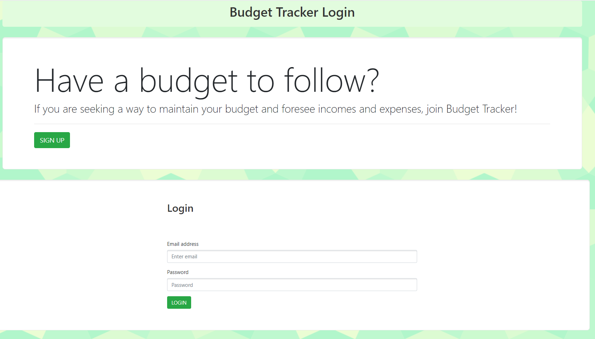
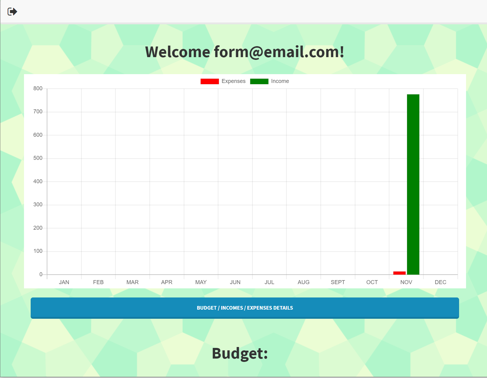
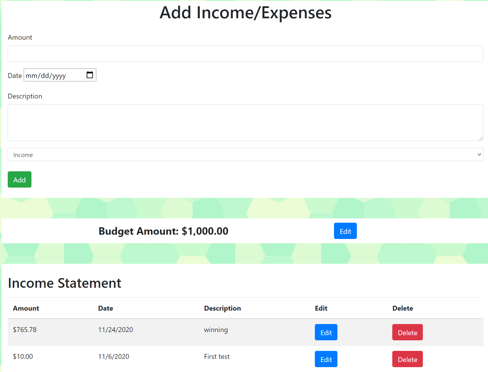

# Budget Tracker
The Budget Tracker application will provide the ability to track incomes and expenses with a budget. With such abilities, users will be able to view their futures in a more monetary manner.

**Created**: `2020 November 06`
 
Heroku: https://budget-hero.herokuapp.com/
 
Repository: https://github.com/ShueMoua/Budget_Tracker

## Table of Contents
* [Usage](#usage)
* [Installation](#installation)
* [Credits & Thank You](#credits)
* [Testing](#testing)
* [License](#license)

# Development
## Team Members
* Shue Moua
* Tsin Moua
* Charline Lach
* Adam Neubauer

## Usage Instructions
To utilize this website/application, end users may access it via the [Budget Tracker link](https://budget-hero.herokuapp.com). The user can sign up for a new account, using a unique email address and password. If they already have an account, they can login and be brought to the Home Page. This UI shows a chart of income and expense occurrences, a high level view of income, expense, and budget output. Users can easily insert new incomes and expenses, as well as edit or delete, on a Details page.
 

Screenshots

 

 

 

## Installation Instructions
N/A

## Testing
Use Budget Tracker with an account or create a new one.

## Credits & Thank Yous
Thank you to our Instructor, TAs, and Google solutions!

# License Information
MIT License
Copyright © 2020
